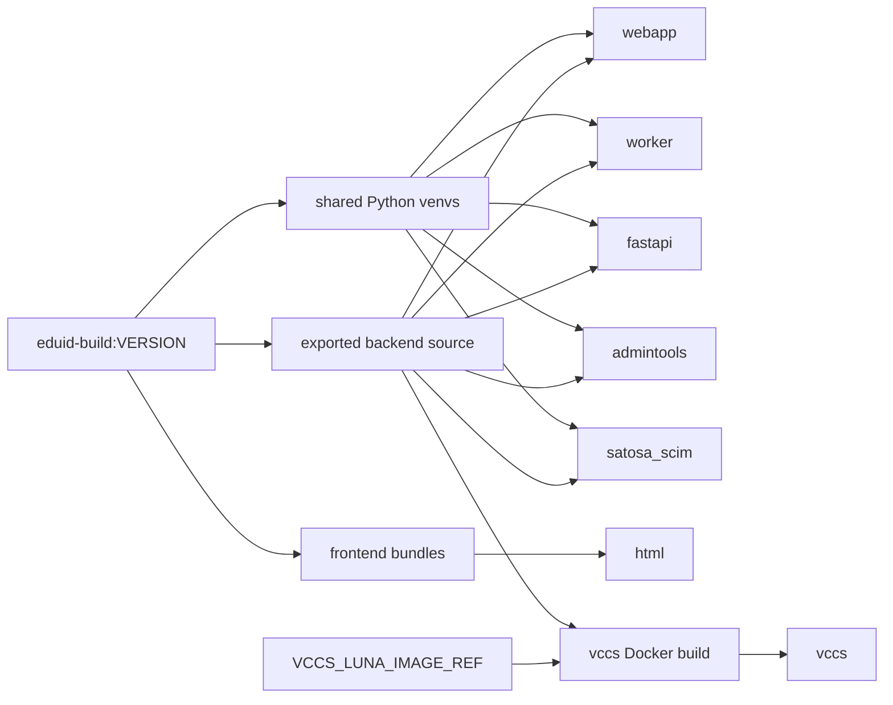

# Artifact Flow

## Purpose

Explain what artifacts are produced, where they are created, and which runtime images consume them.

## Source Of Truth

- `build/Makefile`
- `build/build-js.sh`
- `build/setup-venv.sh`
- `images/*/Dockerfile`

## Flow Overview

## Shared Build Outputs

The intermediate `eduid-build:$VERSION` image is the main artifact factory for this repository.

It produces:

- Python virtual environments under:
	- `/opt/eduid/admintools`
	- `/opt/eduid/fastapi`
	- `/opt/eduid/satosa_scim`
	- `/opt/eduid/webapp`
	- `/opt/eduid/worker`
- frontend bundles under `/opt/eduid/eduid-front`
- frontend bundles under `/opt/eduid/eduid-managed-accounts`

It also contains exported source trees under `build/sources/` and a `build/submodules.txt` snapshot of submodule state.

## Runtime Consumption

### Shared-venv Python images

These images copy a prebuilt virtual environment from `eduid-build:$VERSION`:

- `webapp`
- `worker`
- `fastapi`
- `admintools`
- `satosa_scim`

They also copy exported backend source into `/opt/eduid/src`.

### Frontend delivery image

`html` copies:

- static HTML and nginx content from `eduid-html`
- built `eduid-front` assets from `/opt/eduid/eduid-front`
- built `eduid-managed-accounts` assets from `/opt/eduid/eduid-managed-accounts`

### VCCS exception

`vccs` does not copy a prebuilt Python virtual environment from the shared build. It uses the exported backend source and requirements as inputs, then builds `/opt/eduid/fastapi` inside its own Dockerfile.

## Provenance Files

The current build flow records:

- `revision.txt` inside each exported source tree
- `build/submodules.txt` before building the intermediate image

These are useful breadcrumbs, but they are not formal build attestations.