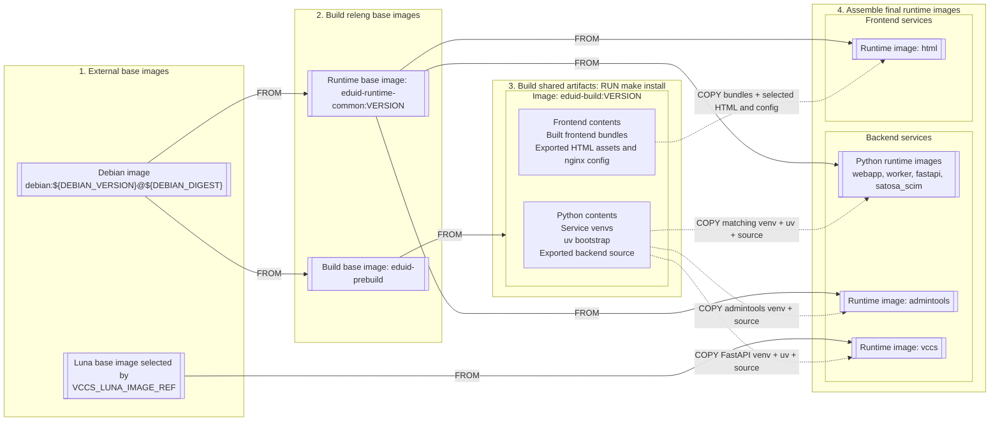

# Artifact Flow

## Purpose

Explain what artifacts are produced, where they are created, and which runtime images consume them.

## Source Of Truth

- `build/Makefile`
- `build/Dockerfile`
- `build/build-js.sh`
- `build/setup-venv.sh`
- `images/*/Dockerfile`

## Flow Overview

Double-bordered nodes represent container images. Ordinary boxes inside the
`eduid-build:VERSION` group represent files and directories contained in that
image, not separate images. Solid `FROM` arrows identify parent images;
dashed `COPY` arrows name the subset of contents copied from the shared build
image into each runtime image.

Four shared-base Python runtime images are grouped for readability; they remain
separate images, each copying its matching service venv. `admintools` is shown
separately because it does not copy the uv bootstrap. Revision metadata and
releng-owned startup scripts, along with SATOSA package overlays, are omitted
from this overview.

The numbered stages distinguish external inputs, releng base-image builds,
shared artifact creation, and final runtime-image assembly. They show dependency
flow, not a strict Make execution order. The final outputs are deployable images;
starting containers from them is a separate deployment operation.

```mermaid
flowchart LR
	subgraph EXTERNAL["1. External base images"]
		Q[["Debian image<br/>debian:${DEBIAN_VERSION}@${DEBIAN_DIGEST}"]]
		L[["Luna base image selected by<br/>VCCS_LUNA_IMAGE_REF"]]
	end
	subgraph BASES["2. Build releng base images"]
		T[["Build base image: eduid-prebuild"]]
		R[["Runtime base image: eduid-runtime-common:VERSION"]]
	end
	subgraph ARTIFACTS["3. Build shared artifacts: RUN make install"]
		subgraph BUILD["Image: eduid-build:VERSION"]
			B["Python contents<br/>Service venvs<br/>uv bootstrap<br/>Exported backend source"]
			C["Frontend contents<br/>Built frontend bundles<br/>Exported HTML assets and nginx config"]
		end
	end
	subgraph FINAL["4. Assemble final runtime images"]
		subgraph BACKEND["Backend services"]
			P[["Python runtime images<br/>webapp, worker, fastapi, satosa_scim"]]
			A[["Runtime image: admintools"]]
			M[["Runtime image: vccs"]]
		end
		subgraph FRONTEND["Frontend services"]
			J[["Runtime image: html"]]
		end
	end

	Q -->|FROM| T
	Q -->|FROM| R
	T -->|FROM| BUILD
	R -->|FROM| P
	R -->|FROM| A
	R -->|FROM| J
	L -->|FROM| M
	B -.->|COPY matching venv + uv + source| P
	B -.->|COPY admintools venv + source| A
	B -.->|COPY FastAPI venv + uv + source| M
	C -.->|COPY bundles + selected HTML and config| J
```

## Shared Build Outputs

The intermediate `eduid-build:$VERSION` image is the main artifact factory for this repository.

It inherits from `eduid-prebuild`, which supplies Debian Python, native build
dependencies, npm, and `/opt/uv-bootstrap`. The shared build creates the service
venvs and frontend bundles; runtime images copy the resulting artifacts,
including the inherited uv bootstrap, rather than inheriting from `eduid-prebuild`.

It produces:

- Python virtual environments under:
	- `/opt/eduid/admintools`
	- `/opt/eduid/fastapi`
	- `/opt/eduid/satosa_scim`
	- `/opt/eduid/webapp`
	- `/opt/eduid/worker`
- frontend bundles under `/opt/eduid/eduid-front`
- frontend bundles under `/opt/eduid/eduid-managed-accounts`

It also contains exported source trees under `build/sources/` and a `build/submodules.txt` snapshot of submodule state.

## Runtime Consumption

### Shared-venv Python images

These images copy a prebuilt virtual environment from `eduid-build:$VERSION`:

- `webapp`
- `worker`
- `fastapi`
- `admintools`
- `satosa_scim`

They also copy exported backend source into `/opt/eduid/src`.

They inherit common operating-system setup from `eduid-runtime-common:$VERSION`.

### Frontend delivery image

`html` copies:

- static HTML and nginx content from `eduid-html`
- built `eduid-front` assets from `/opt/eduid/eduid-front`
- built `eduid-managed-accounts` assets from `/opt/eduid/eduid-managed-accounts`

It also inherits its common operating-system setup from
`eduid-runtime-common:$VERSION`.

### VCCS exception

`vccs` copies `/opt/eduid/fastapi`, `/opt/uv-bootstrap`, exported backend source
into `/opt/eduid/src`, and backend revision metadata from `eduid-build:$VERSION`.
The backend is also installed in the venv.
Unlike the other Python runtime images, it
starts from the separately selected Luna client base rather than
`eduid-runtime-common:$VERSION`. Debian packages provide its runtime Python;
the copied venv and native dependencies must be compatible with that base.

## Provenance Files

The current build flow records:

- `revision.txt` inside each exported source tree
- `build/submodules.txt` before building the intermediate image

These are useful breadcrumbs, but they are not formal build attestations.