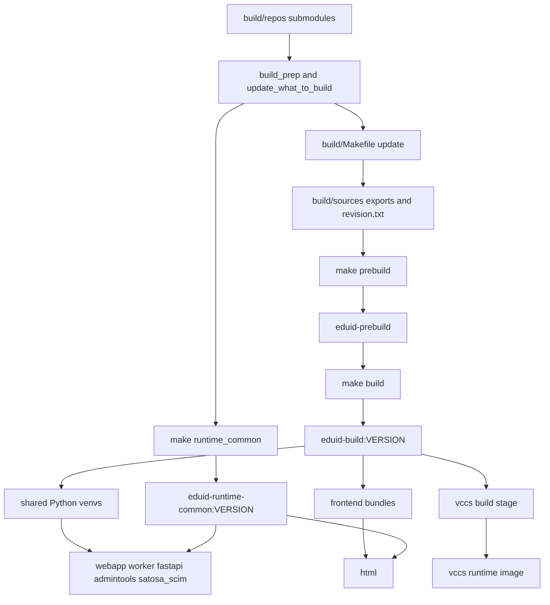

# Build Pipeline

## Purpose

Document the active build path from submodule checkout to runtime images.

## Source Of Truth

- `Makefile`
- `build/Makefile`
- `build/build-js.sh`
- `build/setup-venv.sh`
- `images/prebuild/Dockerfile`

## Pipeline Overview

## Pipeline Stages

### 1. Prepare submodules

`make build_prep` initializes and updates the submodules under `build/repos/`.

`make update_what_to_build` then:

1. pulls the releng repo
2. checks submodules out to `origin/main`
3. fetches remote state
4. checks submodules out to `$(BRANCH)`

This is the current release-input selection model. It is branch-driven rather than manifest-driven.

### 2. Build the shared runtime parent

`make runtime_common` delegates to `images/runtime_common/Makefile`, which
builds `eduid-runtime-common:$VERSION` from `images/runtime_common/Dockerfile`.

That image:

- starts from `debian:${DEBIAN_VERSION}@${DEBIAN_DIGEST}`
- runs the shared runtime `dist-upgrade`
- installs the common runtime troubleshooting packages
- creates the `eduid` user and group
- creates `/var/log/eduid` and `/opt/eduid`

### 3. Build the shared prebuild image

`make prebuild` delegates to `images/prebuild/Makefile`, which builds `eduid-prebuild` from `images/prebuild/Dockerfile`.

That image:

- starts from `debian:${DEBIAN_VERSION}@${DEBIAN_DIGEST}`
- installs build dependencies for Python and frontend artifacts
- creates `/opt/uv-bootstrap`
- installs `uv` into that bootstrap environment with `pip`

### 4. Export clean source trees

`build/Makefile` target `update` removes any previous `build/sources/` tree and recreates it with `git archive` from each submodule.

For each exported repo it also writes a `revision.txt` file using `git show --summary`.

### 5. Build shared artifacts

`make build` writes `build/submodules.txt` and then builds `eduid-build:$VERSION` from `build/Dockerfile`.

Inside that image, `build/Makefile` target `install` runs:

- `setup-venv.sh` for `admintools`, `fastapi`, `satosa_scim`, `webapp`, and `worker`
- `build-js.sh` for `eduid-front` and `eduid-managed-accounts`

### 6. Build runtime images

`make dockers` builds these runtime images:

- `webapp`
- `worker`
- `satosa_scim`
- `fastapi`
- `admintools`
- `html`
- `vccs`

The Debian-based images inherit from `eduid-runtime-common:$VERSION` and copy
artifacts from `eduid-build:$VERSION`. `vccs` instead builds its Python
environment in-place from the reviewed Luna tag.

## Current Tooling Notes

- Frontend builds require committed `package-lock.json` files.
- Frontend installs use `npm ci --ignore-scripts --no-audit --no-fund`.
- Shared Python installs use `uv pip install --require-hashes` against backend requirements.
- `uv` is intentionally bootstrapped from `pip` without a releng pin.
- The active CI workflow still runs with `DOCKER_BUILDKIT=0`.

## Validation Anchors

When this flow changes, verify the relevant layer directly:

- shell scripts: `bash -n build/build-js.sh build/setup-venv.sh`
- orchestration changes: `make -n <target>`
- workflow changes: focused diff or workflow-specific validation