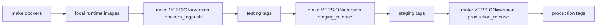

# Promotion Operations

## Purpose

Document how already-built images move from testing to staging and production.

## Source Of Truth

- `Makefile`
- `images/*/Makefile`

## Promotion Overview



## Current Promotion Steps

### Promote to staging

```bash
make VERSION=<version> staging_release
```

This pulls each `$(VERSION)-testing` image, retags it as `$(VERSION)-staging`, and pushes the staging tag.

### Promote to production

```bash
make VERSION=<version> production_release
```

This pulls each `$(VERSION)-staging` image, retags it as `$(VERSION)-production`, and pushes the production tag.

## Services Included

Promotion covers:

- `webapp`
- `worker`
- `satosa_scim`
- `fastapi`
- `admintools`
- `html`
- `vccs`

## Important Current Property

Promotion does not rebuild images. It only retags previously built images.

## Current Limitation

The repo promotes by tag. It does not yet define a digest-based promotion contract or first-class attestation flow.