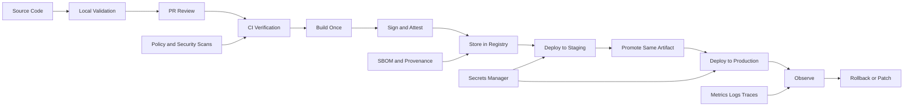

```mermaid
    flowchart LR
        A[Source Code] --> B[Local Validation]
        B --> C[PR Review]
        C --> D[CI Verification]
        D --> E[Build Once]
        E --> F[Sign and Attest]
        F --> G[Store in Registry]
        G --> H[Deploy to Staging]
        H --> I[Promote Same Artifact]
        I --> J[Deploy to Production]
        J --> K[Observe]
        K --> L[Rollback or Patch]

        M[Secrets Manager] --> H
        M --> J
        N[Policy and Security Scans] --> D
        O[SBOM and Provenance] --> G
        P[Metrics Logs Traces] --> K
```