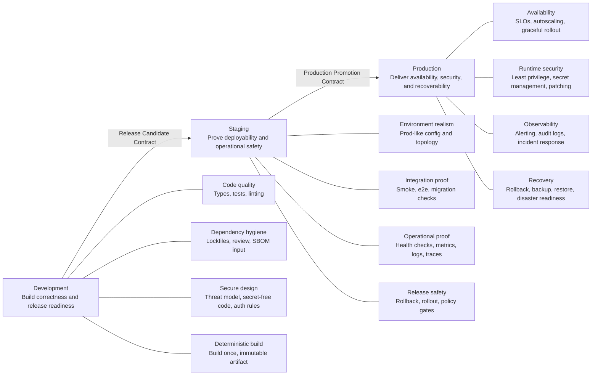

```mermaid
flowchart LR
    A[Development<br/>Build correctness and release readiness] -->|Release Candidate Contract| B[Staging<br/>Prove deployability and operational safety]
    B -->|Production Promotion Contract| C[Production<br/>Deliver availability, security, and recoverability]

    A1[Code quality<br/>Types, tests, linting]
    A2[Dependency hygiene<br/>Lockfiles, review, SBOM input]
    A3[Secure design<br/>Threat model, secret-free code, auth rules]
    A4[Deterministic build<br/>Build once, immutable artifact]

    B1[Environment realism<br/>Prod-like config and topology]
    B2[Integration proof<br/>Smoke, e2e, migration checks]
    B3[Operational proof<br/>Health checks, metrics, logs, traces]
    B4[Release safety<br/>Rollback, rollout, policy gates]

    C1[Availability<br/>SLOs, autoscaling, graceful rollout]
    C2[Runtime security<br/>Least privilege, secret management, patching]
    C3[Observability<br/>Alerting, audit logs, incident response]
    C4[Recovery<br/>Rollback, backup, restore, disaster readiness]

    A --- A1
    A --- A2
    A --- A3
    A --- A4

    B --- B1
    B --- B2
    B --- B3
    B --- B4

    C --- C1
    C --- C2
    C --- C3
    C --- C4
```
