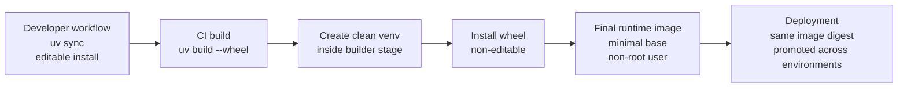
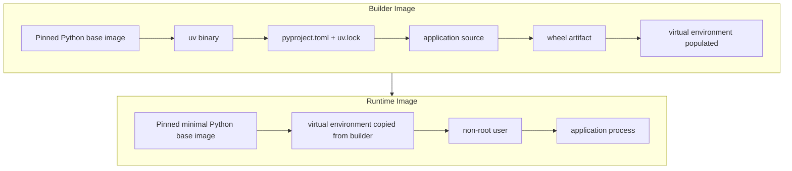
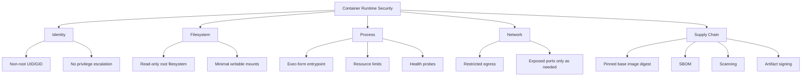

# Production Python Environments in Containers (2026)

This document consolidates the guidance discussed in the chat into a single reference focused only on containerized deployments.

The central recommendation is simple:

- use editable installs only for development
- build immutable artifacts in CI
- install the application non-editably in the container image used for deployment
- run the final container with a minimal runtime surface and explicit security controls

## Executive Summary

For Python in production in 2026, the most defensible container pattern is:

1. Define dependencies and project metadata in `pyproject.toml`.
2. Lock dependencies with `uv.lock`.
3. Build the application wheel in CI from a specific commit.
4. Create a dedicated virtual environment inside the image build.
5. Install the project into that virtual environment non-editably from the wheel.
6. Copy only the ready runtime environment into the final image.
7. Run the container as a non-root user with a minimal base image and tightened runtime controls.

This approach optimizes for reproducibility, provenance, incident response, and least privilege.

## Scope

This document considers only:

- containerized deployment
- `uv` as the development and build tool
- Python application delivery as an immutable runtime artifact

This document does not cover:

- VM or bare-metal deployments
- system Python deployments on shared hosts
- non-container packaging patterns such as OS-native packages

## Core Principles

The production model should be based on five principles.

### 1. Immutability

The exact code and dependency set that passed CI should be the same code and dependency set that reaches production.

That means:

- no dependency resolution during container startup
- no editable install in production
- no bind-mounted source tree in production
- no last-minute `pip install` or `uv sync` during deployment

### 2. Reproducibility

The build should be deterministic enough that the image can be traced back to:

- a commit
- a lock file
- a pinned base image digest
- a known CI pipeline run

### 3. Least Privilege

The final runtime should:

- run as a non-root user
- have a minimal filesystem surface
- use the smallest practical base image
- have only the network access and Linux capabilities it actually needs

### 4. Separation of Concerns

Development and production have different goals.

- development optimizes for iteration speed
- production optimizes for integrity, traceability, and safe operation

### 5. Supply Chain Control

The deployment artifact should be built from approved dependencies and scanned, signed, and attributable.

## Development vs Production

Development commonly uses editable installs because they are convenient. Production should not.

### Development Model

Typical local workflow with `uv`:

```bash
uv sync
```

Typical characteristics:

- project is installed editable
- source tree is live and mutable
- dev dependencies are present
- fast feedback is prioritized

### Production Model

Typical production workflow:

```bash
uv build --wheel
uv venv /opt/venv
uv pip install --python /opt/venv/bin/python dist/*.whl
```

Typical characteristics:

- project is installed non-editably
- runtime environment is immutable
- only runtime dependencies are present
- deployment is artifact-driven

### Why Editable Installs Should Not Reach Production

Editable mode is useful for development but undesirable in production for several reasons:

- it ties runtime behavior to the state of the source tree
- it weakens the guarantee that the deployed artifact matches what was built and tested
- it makes incident analysis less precise because code can be influenced by mutable files
- it can hide packaging defects because runtime assets are available from the checkout even when they are not correctly included in the distributable artifact

## Recommended Production Packaging Model

The recommended installation model for production is:

1. build a wheel in CI from the release commit
2. create a clean virtual environment during image build
3. install the wheel into that environment
4. copy only the ready-to-run virtual environment into the final image

This gives a clear separation between build-time and runtime concerns.



## Reference Container Build Flow

The recommended container build has two main stages.

### Builder Stage

The builder stage may include:

- `uv`
- compiler toolchain if native builds are required
- lock file and packaging metadata
- the project source needed to build the wheel

The builder stage is allowed to be larger and more capable because it is not deployed.

### Runtime Stage

The runtime stage should include only:

- the Python runtime
- the application virtual environment
- required runtime shared libraries
- the application entrypoint

It should exclude:

- compilers
- headers
- source checkout unless strictly required
- build caches
- package manager tooling not needed at runtime



## Reference Dockerfile Pattern

This is a representative pattern for a production image using `uv`.

```dockerfile
# syntax=docker/dockerfile:1.7

FROM python:3.13-slim@sha256:<pin-real-digest-here> AS builder

ENV PYTHONDONTWRITEBYTECODE=1 \
    PYTHONUNBUFFERED=1 \
    UV_PYTHON_DOWNLOADS=never \
    UV_LINK_MODE=copy

WORKDIR /build

RUN apt-get update && apt-get install -y --no-install-recommends \
    build-essential \
    gcc \
    && rm -rf /var/lib/apt/lists/*

COPY --from=ghcr.io/astral-sh/uv:0.7.12 /uv /uvx /bin/

COPY pyproject.toml uv.lock README.md ./
COPY src ./src

RUN uv build --wheel

RUN uv venv /opt/venv
ENV PATH="/opt/venv/bin:$PATH"

RUN uv pip install --python /opt/venv/bin/python dist/*.whl

FROM python:3.13-slim@sha256:<pin-real-digest-here> AS runtime

ENV PYTHONDONTWRITEBYTECODE=1 \
    PYTHONUNBUFFERED=1 \
    PATH="/opt/venv/bin:$PATH"

RUN groupadd --system --gid 10001 app \
    && useradd --system --uid 10001 --gid 10001 --create-home --home-dir /home/app app

WORKDIR /app

COPY --from=builder /opt/venv /opt/venv

USER 10001:10001

CMD ["myapp"]
```

## Why the Project Should Be Installed from a Wheel

The project should normally be installed in production from a wheel rather than with an editable install or a direct source install.

### Benefits

- wheel contents are explicit and reviewable
- deployment becomes artifact-based rather than source-based
- provenance and signing fit naturally around wheel creation and image promotion
- packaging problems are exposed earlier
- runtime behavior is less sensitive to mutable files in the image or on the host

### Acceptable Alternative

If a wheel is not yet available, a non-editable source install during image build is still better than an editable install. However, it is weaker operationally because the boundary between source and packaged artifact is less clear.

## Choosing the Python Source in Production

Using `uv` in development does not automatically mean `uv` must also be the interpreter supplier in production. Both of the following production models can be valid.

### Model A: Image-Provided Python, uv-Managed Environment

In this model:

- `pyproject.toml` declares the supported Python range
- the container image provides the actual Python interpreter
- `uv` validates compatibility, creates the virtual environment, and installs packages

This is usually the most conservative and operations-friendly model for containers because the interpreter comes from the same image artifact that is already pinned, scanned, signed, and promoted.

Advantages:

- one clear interpreter supply path
- easier provenance and incident analysis
- simpler vulnerability scanning story
- straightforward builder and runtime consistency

Typical pattern:

```dockerfile
FROM python:3.13-slim@sha256:<digest>

ENV UV_PYTHON_DOWNLOADS=never
RUN uv venv /opt/venv --python /usr/local/bin/python3.13
```

### Model B: Fully uv-Managed Python and Environment

In this model:

- `pyproject.toml` declares the supported Python range
- `uv` provides the Python interpreter
- `uv` also creates the virtual environment and installs packages

This can be a coherent model if it is deliberate and the `uv`-managed interpreter is the only interpreter path that matters in the image.

Advantages:

- one toolchain for developer and production Python provisioning
- tighter alignment between local and CI workflows
- explicit Python version management through `uv`

Tradeoffs:

- interpreter provenance now depends on the `uv` Python supply path rather than only on the base image
- scanning and attestation need to account for that interpreter source clearly
- operators can no longer assume the image-provided Python is the one actually in use

### The Mixed Model to Avoid

The confusing model is this:

- the image already provides Python
- `uv` is also allowed to fetch or manage a different Python
- the application ends up running whichever interpreter happens to be selected

That creates two interpreter supply paths and weakens clarity around provenance, patching, and runtime debugging.

### Recommendation

For most production container environments, the stronger default is Model A:

- use the image as the source of the interpreter
- use `uv` to enforce `requires-python`, create the virtual environment, and install dependencies
- set `UV_PYTHON_DOWNLOADS=never` so `uv` does not silently introduce another interpreter source

Model B can still be reasonable if your platform intentionally standardizes on `uv` for interpreter provisioning as well, but in that case `uv` should be the only interpreter source that matters in the image.

### Security Tradeoffs: python-build-standalone vs Image-Provided Python

When `uv` downloads managed CPython builds, it normally uses Astral's `python-build-standalone` distributions. This is not inherently insecure, but it changes the interpreter supply-chain model.

#### Image-Provided Python

Strengths:

- the base image is the single obvious source for the interpreter
- the image digest identifies both the OS layer and the Python runtime source
- standard container scanning workflows align naturally with the runtime interpreter
- rebuilding from an updated base image is a familiar patching path for operations teams

Tradeoffs:

- interpreter patch cadence follows the image maintainer
- choosing unusual or highly specific interpreter builds may be less flexible

Operationally, this is usually the clearest model because provenance, scanning, approval, and patching all point to the same artifact.

#### python-build-standalone via uv

Strengths:

- more direct control over exact Python version selection
- a consistent Python provisioning toolchain across developer machines, CI, and production
- less dependence on which interpreter builds a base image maintainer publishes

Tradeoffs:

- interpreter provenance now depends on an additional supply path beyond the base image
- scanning and attestation need to explicitly account for the downloaded Python distribution
- patching the runtime interpreter may require updating the managed Python artifact independently of the base image
- operators can no longer assume that the image's built-in Python is the runtime interpreter in use

Operationally, this can still be secure, but only if it is treated as a first-class supply-chain input with explicit controls.

#### Recommended Security Position

For conservative production container environments, image-provided Python is usually the lower-friction security choice because it keeps interpreter provenance tied to the pinned image.

Using `python-build-standalone` through `uv` can still be valid, but only if:

- it is the intentional and documented interpreter source
- its download source or mirror is approved
- SBOM generation and vulnerability scanning cover that interpreter path clearly
- patching and attestation workflows treat it as a distinct supply-chain component

The weakest option is the mixed model in which the image provides one Python while `uv` silently downloads another. That creates ambiguity around what interpreter is actually running and makes security ownership less clear.

## Runtime Security Controls

The container build pattern is only half of the production answer. Runtime hardening matters just as much.

### Required Baseline Controls

1. Run as non-root.
2. Pin base images by digest.
3. Use a minimal runtime image.
4. Keep build tools out of the runtime image.
5. Inject secrets at runtime, not during image build.
6. Use image scanning for both OS and Python layers.
7. Sign the image and verify provenance in deployment.

### Strongly Recommended Runtime Controls

- read-only root filesystem where feasible
- explicit writable mount points only for required paths
- dropped Linux capabilities
- `allowPrivilegeEscalation: false`
- seccomp and AppArmor or equivalent defaults
- constrained outbound network access
- CPU and memory limits
- readiness and liveness probes at the orchestrator level



## Supply Chain and Security Considerations

### Locking and Dependency Integrity

Use a committed `uv.lock` and fail the build if the lock file does not match the project metadata.

Practical controls:

- keep `uv.lock` in version control
- build from a specific commit
- avoid automatic interpreter downloads in production image builds
- use approved package sources in CI

`UV_PYTHON_DOWNLOADS=never` is important because it prevents `uv` from fetching an unexpected interpreter during the build.

### SBOM, Scanning, and Signing

A secure build should produce:

- an SBOM for the final image
- vulnerability scan results covering OS and Python packages
- a signed image or equivalent attested deployment artifact
- provenance metadata tied to the CI run

### Secrets Handling

Do not bake secrets into:

- the image
- the wheel
- the lock file
- the build context

Secrets should be injected at runtime through the container orchestration platform.

### Network Policy

Most Python services do not need arbitrary outbound access. Restrict egress to only the systems the service genuinely requires.

## Packaging Checklist

The main operational risk when moving from editable development to non-editable production is incomplete packaging.

Before relying on wheel-based deployment, verify all of the following:

1. The project builds successfully as a wheel.
2. All importable runtime packages are included in the wheel.
3. Templates, static files, migrations, translations, schemas, and similar runtime assets are packaged explicitly.
4. Console entry points are declared properly if the application starts through a package-defined command.
5. Runtime dependencies are separate from development dependencies.
6. The application does not depend on repo-relative files outside the package.
7. The application does not require a Git checkout at runtime.
8. The startup command works against the installed package in the virtual environment.
9. The image can start without bind-mounted source code.
10. Configuration is externalized.
11. Secrets are not embedded in package data or image layers.
12. The final image can be scanned and traced back to the exact build.

## Recommended Validation Pattern in CI

Before promoting an image, validate the distributable artifact itself rather than assuming development behavior proves packaging correctness.

Example:

```bash
uv build --wheel
uv venv .tmp-venv
uv pip install --python .tmp-venv/bin/python dist/*.whl
.tmp-venv/bin/python -c "import myapp; print(myapp.__file__)"
```

This catches a common class of issues:

- the project works locally in editable mode
- the built wheel is missing modules or data files
- the runtime image then fails even though development looked fine

## Operational Anti-Patterns

The following patterns should generally be avoided in production containers:

- editable install in the deployed image
- rebuilding dependencies on container startup
- using unpinned base image tags such as `latest`
- running the app as root
- leaving compilers and package managers in the runtime image without a concrete need
- embedding secrets in image layers
- mounting the source tree over the installed application in production
- depending on local `.env` files baked into the image

## Decision Summary

If development uses `uv` editable installs, the corresponding production answer should be:

- build the project wheel in CI
- install it non-editably into a dedicated virtual environment during image build
- copy only the ready runtime into the final image
- deploy the same image digest through environments
- harden the container runtime with least-privilege defaults

## Short Answer

For containerized Python production deployments in 2026, use editable installs only in development. In production, install the project from a wheel into a clean virtual environment inside a multi-stage image build, run the final image as a non-root user, keep the runtime minimal, and enforce supply-chain and runtime security controls around the artifact.